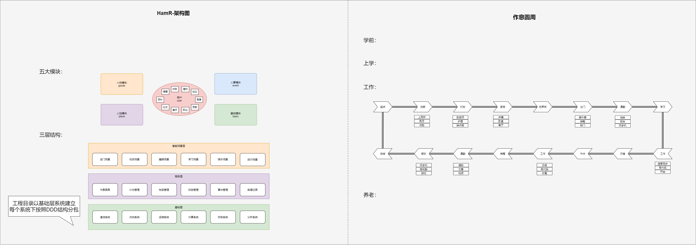

# HamR [哈默尔-私家助理]

## 背景
人类是群居生物，从古至今都离不开"家"这一概念，无论是大家还是小家，无论社会怎么变化，无论时代怎么发展，
其实我们一直想有一个美好幸福的家庭，这样才能有更好的社会，才会创造更多的价值，才会是宇宙里最好的生命体。
本系统致力于打造免费家庭智能助理，帮助更好发展和管理，成就人类家庭的命运共同体。
  
因此推出 "家布(JiaBu)"与"哈默尔(HamR)"两款分布式系统工具，
用于辅助决策与管理家庭，利用数字化工具建立幸福美好的家园。

哈默尔(HamR)将会是家里的大管家，一经部署即可成为家里的智能管家，帮助打理家里的一切。
家布(JiaBu)将致力于引导家庭资源分配、布局未来、智能决策、为家族成员分担压力，同时给出问题的参考方案。
它将辅助于"哈默尔(HamR)"进行家庭管理，从人、时、事、物、境五个维度综合管理，并且是可私有化部署的不涉及家庭隐私。

---

## 哈默尔(HamR)功能:

- 存储并管理家中各种人、事、物数据
- 辅助收集家族信息（支持私有部署,不涉及隐私）
- 评估家庭幸福感
- 保存大事记，让美好一直存在

---

## 家布(JiaBu)功能：

- 辅助决策，提升家庭幸福感
- 智能提醒，让家中惊喜连连
- 模拟事物发展，谋划布局未来
- 监测环境，给出行动优化建议

## 架构图

---

## 功能梳理

---

## 工程结构

工程采用 DDD思想搭建,以下为工程结构及DDD的简单介绍:

1 ）适配层（Adapter Layer ）：负责对前端展示（web ，wireless ，wap ）的路由和适配，对于传统B/S 系统而言，adapter 就相当于MVC 中的controller ；

2 ）应用层（Application Layer ）：主要负责获取输入，组装上下文，参数校验，调用领域层做业务处理，如果需要的话，发送消息通知等。层次是开放的，应用层也可以绕过领域层，直接访问基础实施层；

3 ）领域层（Domain Layer ）：主要是封装了核心业务逻辑，并通过领域服务（Domain Service ）和领域对象（Domain Entity ）的方法对App 层提供业务实体和业务逻辑计算。领域是应用的核心，不依赖任何其他层次；

4 ）基础实施层（Infrastructure Layer ）：主要负责技术细节问题的处理，比如数据库的CRUD 、搜索引擎、文件系统、分布式服务的RPC 等。此外，领域防腐的重任也落在这里，外部依赖需要通过gateway 的转义处理，才能被上面的App 层和Domain 层使用

